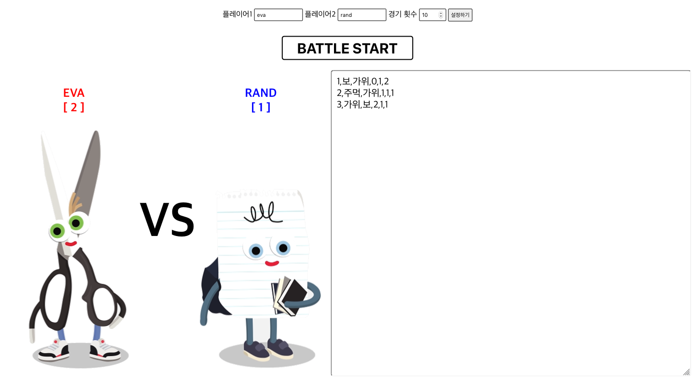

# 가위-바위-보 코딩 대결

## 개요

[Modern PHP User Group](https://www.facebook.com/groups/655071604594451/)의 2018년 송년회를 위한 코딩 대결 게임 입니다.

## 게임 참여 방법

* \Rps\Player 인터페이스 구현한 클래스 제작

    * 인터페이스 파일: [./Rps/Player.php](./Rps/Player.php)

* 클래스명 규칙

    * Player + Name(첫글자만 대문자)

    * 예) PlayerDiablo

* 송년회 당일 개발한 클래스의 코드를 제출

    * 제출 수단:

        * USB 메모리

        * 온라인 다운로드

        * 즉석 코딩

        * 기타 5분 안에 가능한 모든 방법

* 예제 파일 참고

    * [./Rps/PlayerEva.php](./Rps/PlayerEva.php)

    * [./Rps/PlayerRand.php](./Rps/PlayerRand.php)

## 게임 실행 방법

1. 내가 만든 클래스를 ./Rps 디렉토리에 추가

1. PHP 컴포저 설치

    ```bash
    $ composer install
    ```

1. 도커 컨테이너 실행

    ```bash
    $ docker-compose up -d
    ```

1. 브라우저 접속

    [http://127.0.0.1:8080](http://127.0.0.1:8080)

## 게임 실행 트러블 슈팅

꼭 굳이 힘들게 게임을 실행하시지 않으셔도 됩니다.
대회 당일 \Rps\Player 인터페이스를 구현한 클래스의 코드만 제출하시면 됩니다.

## 당일 경기 진행 방식

전반적인 진행 방식이며 세부 사항은 변경될 수 있습니다.

* 참가자 모두 코드 제출

* 개인 또는 팀으로 토너먼트 구성

* 각자 자신이 만든 코드로 가위-바위-보 진행

* 경기 결과에 의한 수상

    * 최다 승리상

    * 알고리즘상

    * 오버테크놀러지상

    * 인기상



## 가위-바위-보 이미지 출처

http://www.polyesterstudio.com/rock-paper-scissors/
